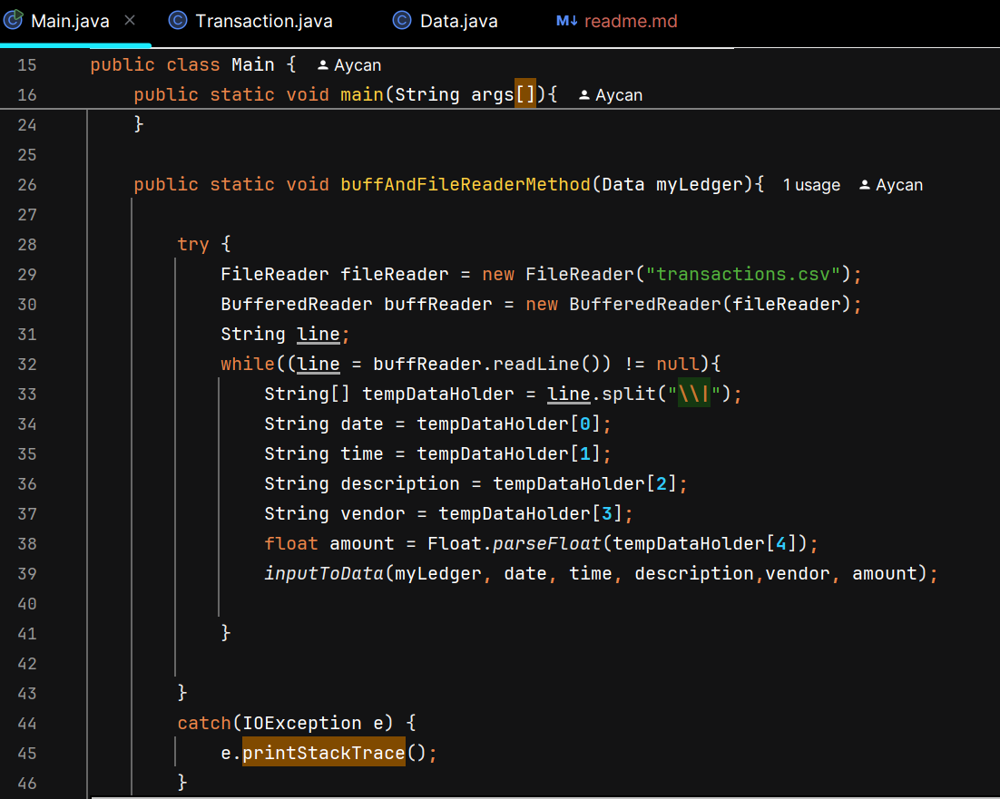
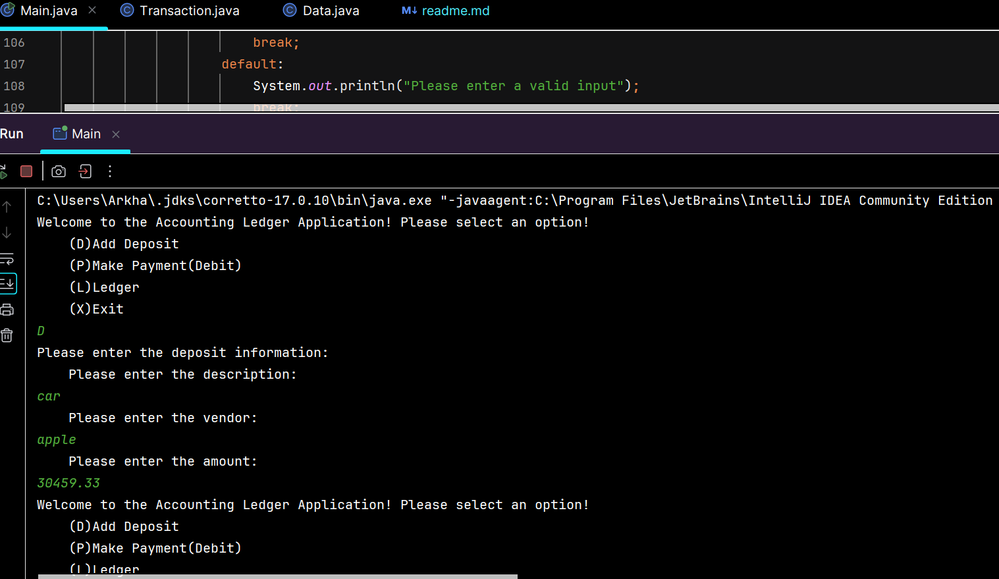
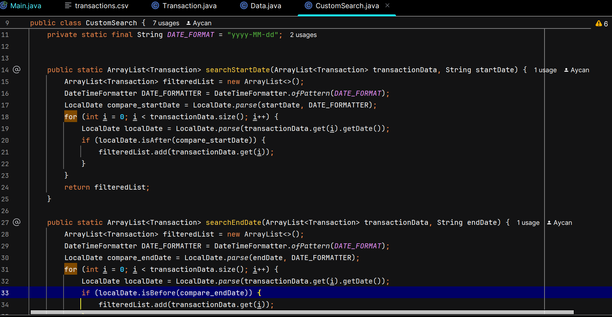

# Aycan's CapStone Project!

## My project is a simple yet efficient accounting ledger application, where all data inputs are recorded to a transaction data storage, where users can display filtered searches.

## Screenshots of Code:

### I thought this part was interesting since it took me the longest while figuring out how to efficiently implement the methods without having to dissect each initial input through nested if-statements.

